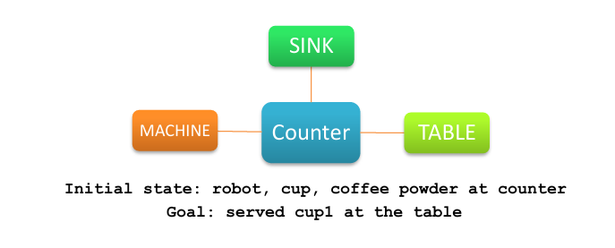
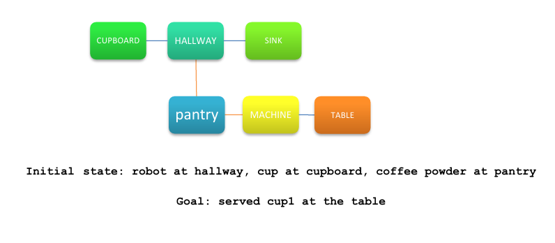
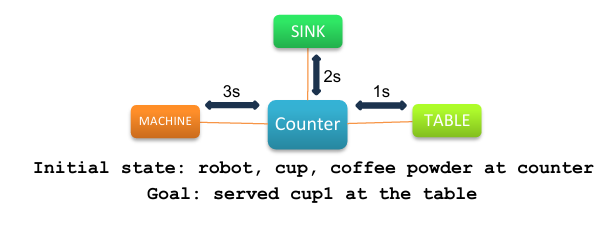
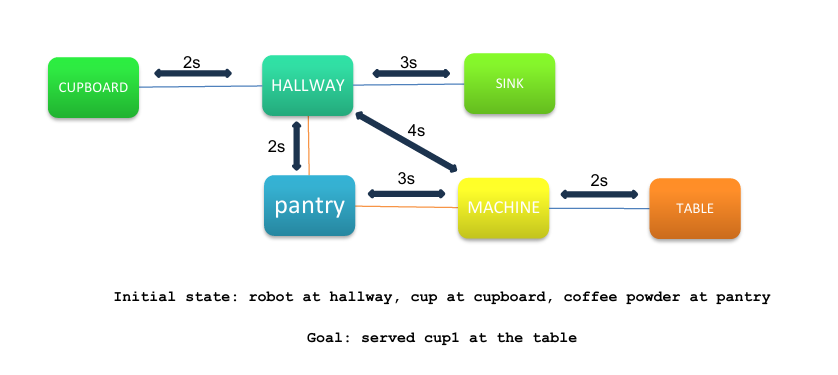

**Final files to check:** 

PDDL — `codes/Q1_pddl/domain_d2v3_basic.pddl` with `codes/Q1_pddl/problem_simple_layout.pddl` and `codes/Q1_pddl/problem_complex_layout.pddl`; 

PDDL+ — `codes/Q2_pddl_plus/domain_d2v3_pddlplus.pddl` with `codes/Q2_pddl_plus/problem_plus_simple_deadline.pddl` and `codes/Q2_pddl_plus/problem_plus_complex_deadline.pddl`.

| Model | Scenario | Domain file | Problem file | Planner output |
|---|---|---|---|---|
| Classical PDDL | Simple layout | `codes/Q1_pddl/domain_d2v3_basic.pddl` | `codes/Q1_pddl/problem_simple_layout.pddl` | `codes/Q1_pddl/plans/simple_layout.txt` |
| Classical PDDL | Complex layout | `codes/Q1_pddl/domain_d2v3_basic.pddl` | `codes/Q1_pddl/problem_complex_layout.pddl` | `codes/Q1_pddl/plans/complex_layout.txt` |
| PDDL+ | Simple layout with deadline | `codes/Q2_pddl_plus/domain_d2v3_pddlplus.pddl` | `codes/Q2_pddl_plus/problem_plus_simple_deadline.pddl` | `codes/Q2_pddl_plus/plans/plus_simple_valid_timed_plan.txt` |
| PDDL+ | Complex layout with deadline | `codes/Q2_pddl_plus/domain_d2v3_pddlplus.pddl` | `codes/Q2_pddl_plus/problem_plus_complex_deadline.pddl` | `codes/Q2_pddl_plus/plans/plus_complex_valid_timed_plan.txt` |

# PDDL & PDDL+ Domestic Service Robot Mobile Manipulator

This repository contains the PDDL and PDDL+ models for Assignment **D2-V3: Domestic Service Robot Mobile Manipulator**.

The task models a domestic service robot preparing and serving coffee in a kitchen. The robot must both navigate between kitchen locations and manipulate objects such as a cup and coffee powder. Navigation and manipulation are deliberately modelled as separate actions, so object access depends on the robot location and movement is never merged with manipulation.

## Repository structure

The repository is organized into the three required folders:

| Folder | Contents |
|---|---|
| `codes/` | Final PDDL and PDDL+ domain/problem files, together with planner outputs. |
| `Report/` | Final PDF report and README images. |
| `slide/` | Final presentation slides. |

### Final submission files

| Deliverable | Final path |
|---|---|
| Classical PDDL files | `codes/Q1_pddl/` |
| PDDL+ files | `codes/Q2_pddl_plus/` |
| Classical PDDL planner outputs | `codes/Q1_pddl/plans/` |
| PDDL+ planner outputs | `codes/Q2_pddl_plus/plans/` |
| Final report | `Report/AI2 Report .pdf` |
| Final slides (PDF) | `slide/PDDL_PDDLPlus_MAHDI BAGHBAN.pdf` |
| Final slides (PowerPoint) | `slide/PDDL_PDDLPlus_MAHDI BAGHBAN.pptx` |
| README images | `Report/Images/` |
## Modelling goals

The model addresses the following requirements:

- The robot must navigate and manipulate objects.
- Navigation and manipulation are separate actions.
- Manipulation actions are only applicable when the robot is at the correct location.
- Movement is not merged with manipulation.
- Q1 uses a classical PDDL model.
- Q2 extends the model to PDDL+ with movement time, continuous progress, and a deadline-violation event.

## Q1: Classical PDDL model

The Q1 model is a classical PDDL model using `:strips` and `:typing`. States are represented with Boolean predicates, and actions update the world through preconditions and effects.

### Main types

| Type | Meaning |
|---|---|
| `location` | A discrete kitchen location such as `counter`, `sink`, `machine`, or `table`. |
| `item` | A general manipulable object. |
| `cup` | A subtype of `item` representing the coffee cup. |
| `ingredient` | A subtype of `item` representing ingredients such as coffee powder. |

### Main predicates

| Predicate group | Predicates | Purpose |
|---|---|---|
| Navigation | `robot-at`, `connected` | Encode the kitchen graph and the current robot location. |
| Manipulation | `handempty`, `holding`, `at` | Encode object locations and gripper capacity. |
| Kitchen functionality | `water-source`, `coffee-machine`, `serving-place` | Make actions depend on the functional role of the current location. |
| Coffee state | `empty`, `has-water`, `has-coffee-powder`, `brewed`, `served` | Represent the causal preparation chain from empty cup to served coffee. |

### Main actions

| Action group | Actions | Purpose |
|---|---|---|
| Navigation | `move` | Moves the robot between connected locations. |
| Object handling | `pick-up`, `put-down` | Allows the robot to pick and place objects only when it is at the same location as the object. |
| Coffee preparation | `fill-water`, `add-coffee-powder`, `brew-coffee`, `serve-coffee` | Represents the symbolic coffee-preparation task. |

## Q1 simple layout




The simple layout uses the `counter` as the central hub. The robot, cup, and coffee powder initially start at the counter. The goal is to serve the prepared coffee at the table.

### Valid plan

| # | Action |
|---:|---|
| 1 | `(pick-up cup1 counter)` |
| 2 | `(move counter sink)` |
| 3 | `(fill-water cup1 sink)` |
| 4 | `(move sink counter)` |
| 5 | `(put-down cup1 counter)` |
| 6 | `(pick-up coffee-powder counter)` |
| 7 | `(add-coffee-powder coffee-powder cup1 counter)` |
| 8 | `(put-down coffee-powder counter)` |
| 9 | `(pick-up cup1 counter)` |
| 10 | `(move counter machine)` |
| 11 | `(brew-coffee cup1 machine)` |
| 12 | `(move machine counter)` |
| 13 | `(move counter table)` |
| 14 | `(serve-coffee cup1 table)` |

## Q1 complex layout



The complex layout distributes the objects across different locations. The robot starts in the hallway, the cup starts in the cupboard, and the coffee powder starts in the pantry. The goal is still to serve the prepared coffee at the table.

### Valid plan

| # | Action |
|---:|---|
| 1 | `(move hallway pantry)` |
| 2 | `(pick-up coffee-powder pantry)` |
| 3 | `(move pantry hallway)` |
| 4 | `(move hallway sink)` |
| 5 | `(put-down coffee-powder sink)` |
| 6 | `(move sink hallway)` |
| 7 | `(move hallway cupboard)` |
| 8 | `(pick-up cup1 cupboard)` |
| 9 | `(move cupboard hallway)` |
| 10 | `(move hallway sink)` |
| 11 | `(fill-water cup1 sink)` |
| 12 | `(put-down cup1 sink)` |
| 13 | `(pick-up coffee-powder sink)` |
| 14 | `(add-coffee-powder coffee-powder cup1 sink)` |
| 15 | `(put-down coffee-powder sink)` |
| 16 | `(pick-up cup1 sink)` |
| 17 | `(move sink hallway)` |
| 18 | `(move hallway machine)` |
| 19 | `(brew-coffee cup1 machine)` |
| 20 | `(move machine table)` |
| 21 | `(serve-coffee cup1 table)` |

## Q2: PDDL+ model

The Q2 model extends the classical PDDL model by introducing time and autonomous world evolution. In the classical model, `move` is instantaneous. In the PDDL+ model, movement is time-consuming and is represented through a start action, continuous progress, and an automatic finishing event.

The `movement-progress` process is load-bearing rather than decorative. It increases the numeric fluent `move-progress`, and the automatic `finish-move` event can only occur when this value reaches `current-move-duration`. Until then, the robot remains in the `moving` state and has not reached its destination, so location-dependent manipulation actions cannot be executed.

### Main PDDL+ constructs

| Construct group | Elements | Purpose |
|---|---|---|
| Navigation action | `start-move` | Starts time-consuming navigation between connected locations. |
| Manipulation actions | `pick-up`, `put-down`, `fill-water`, `add-coffee-powder`, `brew-coffee`, `serve-coffee` | Remain symbolic and instantaneous. |
| Time functions | `elapsed-time`, `deadline` | Store total mission time and the latest acceptable completion time. |
| Movement functions | `move-progress`, `current-move-duration`, `move-duration ?from ?to` | Store movement progress and required movement duration. |
| Processes | `mission-clock`, `movement-progress` | Continuously increase elapsed time and movement progress. |
| Events | `finish-move`, `deadline-violation` | Automatically complete movement or mark mission failure. |

## About planner waiting steps

The planner may insert explicit waiting intervals during timed plan extraction, such as:

```text
-----waiting----- [1.0]
```

These waiting steps are planner-output time-advancement intervals. They are not domain actions, they are not events, and they do not represent manipulation duration. Manipulation actions remain instantaneous in the model; only navigation is modelled as time-consuming.

The waiting steps appear because the planner extracts the PDDL+ plan with a fixed execution delta. The timed tables below are annotated executions: the waiting intervals and agent actions follow the ENHSP `Found Plan`, while the autonomous `finish-move` events are added to make the state transitions explicit.

## Q2 simple PDDL+ timed plan



The mission deadline is `12`. ENHSP first advances time to `1.0`, then the robot picks up the cup and starts moving. Coffee is served at time `12.0`. This is still valid because the `deadline-violation` event fires only when elapsed time becomes greater than the deadline.

The table is an annotated execution: agent actions and waiting intervals follow the ENHSP output, while autonomous `finish-move` events are shown explicitly for clarity.

| Time | Planner output |
|---:|---|
| 0.0 | `-----waiting----- [1.0]` |
| 1.0 | `(pick-up cup1 counter)` |
| 1.0 | `(start-move counter sink)` |
| 1.0 | `-----waiting----- [3.0]` |
| 3.0 | `[event] (finish-move counter sink)` |
| 3.0 | `(fill-water cup1 sink)` |
| 3.0 | `(start-move sink counter)` |
| 3.0 | `-----waiting----- [5.0]` |
| 5.0 | `[event] (finish-move sink counter)` |
| 5.0 | `(put-down cup1 counter)` |
| 5.0 | `(pick-up coffee-powder counter)` |
| 5.0 | `(add-coffee-powder coffee-powder cup1 counter)` |
| 5.0 | `(put-down coffee-powder counter)` |
| 5.0 | `(pick-up cup1 counter)` |
| 5.0 | `(start-move counter machine)` |
| 5.0 | `-----waiting----- [8.0]` |
| 8.0 | `[event] (finish-move counter machine)` |
| 8.0 | `(brew-coffee cup1 machine)` |
| 8.0 | `(start-move machine counter)` |
| 8.0 | `-----waiting----- [11.0]` |
| 11.0 | `[event] (finish-move machine counter)` |
| 11.0 | `(start-move counter table)` |
| 11.0 | `-----waiting----- [12.0]` |
| 12.0 | `[event] (finish-move counter table)` |
| 12.0 | `(serve-coffee cup1 table)` |

## Q2 complex PDDL+ timed plan



The mission deadline is `18`. The valid plan uses the direct edge `pantry -> machine`. With the planner waiting step, coffee is served exactly at time `18.0`, so the deadline is not exceeded.

The table is an annotated execution: agent actions and waiting intervals follow the ENHSP output, while autonomous `finish-move` events are shown explicitly for clarity.

| Time | Planner output |
|---:|---|
| 0.0 | `-----waiting----- [1.0]` |
| 1.0 | `(start-move hallway cupboard)` |
| 1.0 | `-----waiting----- [3.0]` |
| 3.0 | `[event] (finish-move hallway cupboard)` |
| 3.0 | `(pick-up cup1 cupboard)` |
| 3.0 | `(start-move cupboard hallway)` |
| 3.0 | `-----waiting----- [5.0]` |
| 5.0 | `[event] (finish-move cupboard hallway)` |
| 5.0 | `(start-move hallway sink)` |
| 5.0 | `-----waiting----- [8.0]` |
| 8.0 | `[event] (finish-move hallway sink)` |
| 8.0 | `(fill-water cup1 sink)` |
| 8.0 | `(start-move sink hallway)` |
| 8.0 | `-----waiting----- [11.0]` |
| 11.0 | `[event] (finish-move sink hallway)` |
| 11.0 | `(start-move hallway pantry)` |
| 11.0 | `-----waiting----- [13.0]` |
| 13.0 | `[event] (finish-move hallway pantry)` |
| 13.0 | `(put-down cup1 pantry)` |
| 13.0 | `(pick-up coffee-powder pantry)` |
| 13.0 | `(add-coffee-powder coffee-powder cup1 pantry)` |
| 13.0 | `(put-down coffee-powder pantry)` |
| 13.0 | `(pick-up cup1 pantry)` |
| 13.0 | `(start-move pantry machine)` |
| 13.0 | `-----waiting----- [16.0]` |
| 16.0 | `[event] (finish-move pantry machine)` |
| 16.0 | `(brew-coffee cup1 machine)` |
| 16.0 | `(start-move machine table)` |
| 16.0 | `-----waiting----- [18.0]` |
| 18.0 | `[event] (finish-move machine table)` |
| 18.0 | `(serve-coffee cup1 table)` |

## Discussion

### Integration of navigation and manipulation

The integration between navigation and manipulation is achieved by making manipulation actions depend on navigation-related predicates. For example, `pick-up` requires both `(robot-at ?l)` and `(at ?i ?l)`, which means that the robot can only pick up an object when it is located at the same place as that object. Therefore, the planner must first generate navigation actions that bring the robot to the required location before any manipulation action becomes applicable.

The same principle is used for the coffee-preparation actions. The `fill-water` action requires the robot to be at a `water-source` location while holding the cup, `brew-coffee` requires the robot to be at a `coffee-machine` location, and `serve-coffee` requires the robot to be at a `serving-place` location. This directly implements the assignment requirement that object access and manipulation must depend on the robot location.

### Abstraction gap between symbolic and physical motion

The model is deliberately symbolic. It does not compute robot trajectories, grasp poses, arm configurations, collision-free paths, or object geometry. Instead, physical feasibility is abstracted through symbolic predicates such as `robot-at`, `at`, `connected`, and `holding`.

This represents the task-motion gap discussed in the course materials. At the planning level, the robot reasons with discrete locations and logical facts, but real execution would require continuous motion planning, collision checking, grasp planning, and low-level control. Therefore, the PDDL and PDDL+ models capture the high-level task structure, while the detailed physical execution is left outside the scope of this assignment.

## How to run

### Q1 — Classical PDDL

Load the Q1 domain and the matching problem file in a classical PDDL planner, then compare the generated plan with the corresponding file in `codes/Q1_pddl/plans/`.

### Q2 — PDDL+

Use ENHSP or another planner supporting PDDL+ processes, events, numeric fluents, and continuous effects.

Example:

```bash
java -jar enhsp.jar -o <domain-file> -f <problem-file> -planner sat-hmrph
```

## Limitations and known issues

- Manipulation actions are intentionally modelled as instantaneous, while only navigation consumes time.
- The model does not represent geometric trajectories, grasp poses, collision checking, arm configurations, uncertainty, or low-level control.
- Waiting intervals shown in planner output are plan-extraction time-advancement steps; they are not domain actions or events and do not represent manipulation duration.
- The model is therefore suitable for symbolic task-level planning, but it does not represent the complete physical execution of a real robot.


## Notes

- The classical PDDL model is symbolic and does not represent continuous time.
- The PDDL+ model introduces time only for navigation.
- Manipulation actions remain instantaneous.
- Waiting steps in planner output are idle time-advancement intervals, not manipulation duration.
- A plan that is logically valid can still be temporally invalid if it exceeds the deadline.


## References

- Fulvio Mastrogiovanni, *Planning Fundamentals*.
- Fulvio Mastrogiovanni, *Advanced Planning Concepts*.
- Omar Kashmar / TA material, *PDDL Advanced Examples - Class 2*.
- Omar Kashmar / TA material, *PDDL Introduction through 5 Classical Examples*.
